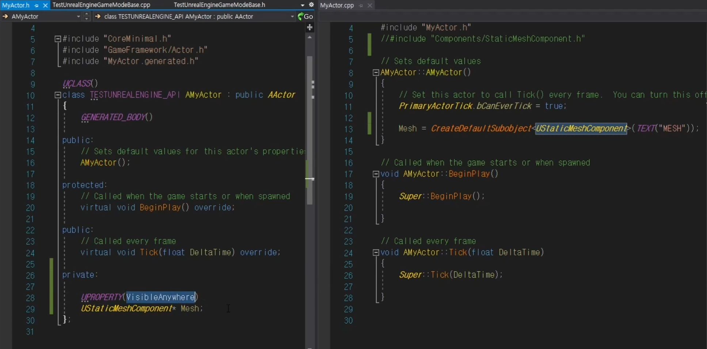
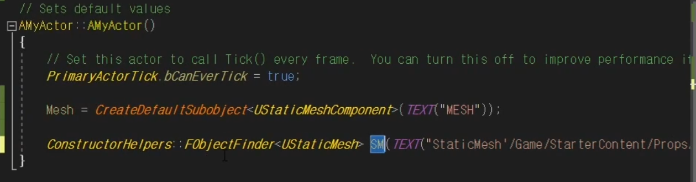
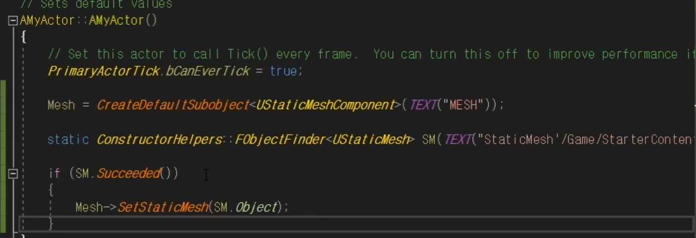
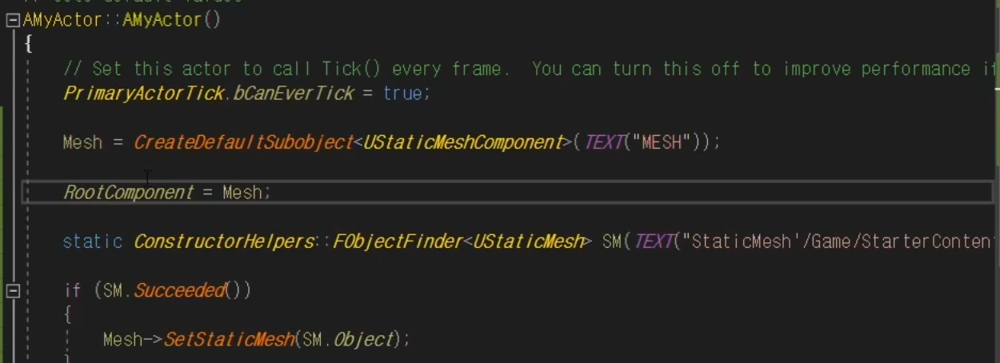
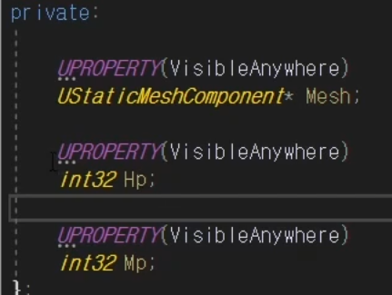
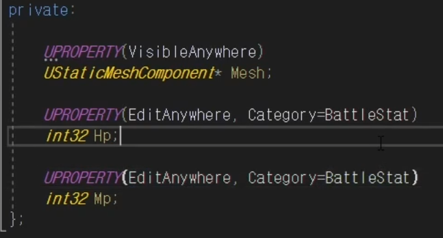
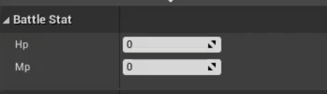

# 언리얼 엔진 기초

 

## C++로 Actor 만들기

 

### 스태틱 메시를 추가하는 UStaticMeshComponent

 

- Create Default SubObject를 통해 생성자에서 Mesh를 초기화하고 있다
- Visible Anywhere 옵션을 통해서 엔진 내에서도 속성이 보이게 할 수 있다

 

### ConstructorHelpers::FObjectFinder를 이용해 StaticMesh 가져오기

 

- TEXT 안에로드할 스태틱 메시의 경로를 입력한다.

 

### FObjectFinder가 성공했는지 확인하는 Succeeded()

 

- 성공적으로 로드되었다면 SetStaticMesh()를 통해 가져온  Mesh로 설정한다

 

### 추가하는 컴포넌트 중 하나를 RootComponent로 만들어주어야 한다

 

 

### 멤버 변수 추가하기

 

 

### EditAnywhere를 통해 에디터에서 수정할 수 있다

 

- Category를 설정할 수도 있다

 

## 로그와 디버깅

 

 

## 게임플레이 프레임워크

 

 

## 캐릭터 생성

 