# 2D 게임 기초

 

## Sprite vs Texture

 

### Texture

- 이미지 파일이다
- Meterial로 만들 수 있다
- 스프라이트 액션의 페이퍼 2D 텍스쳐 세팅 적용과 스프라이트 생성으로 2D 게임에서 사용하는 리소스로 만들 수 있다

 

### Sprite

- 텍스처를 통해 PaperSpriteActor를 생성할 수 있다

 

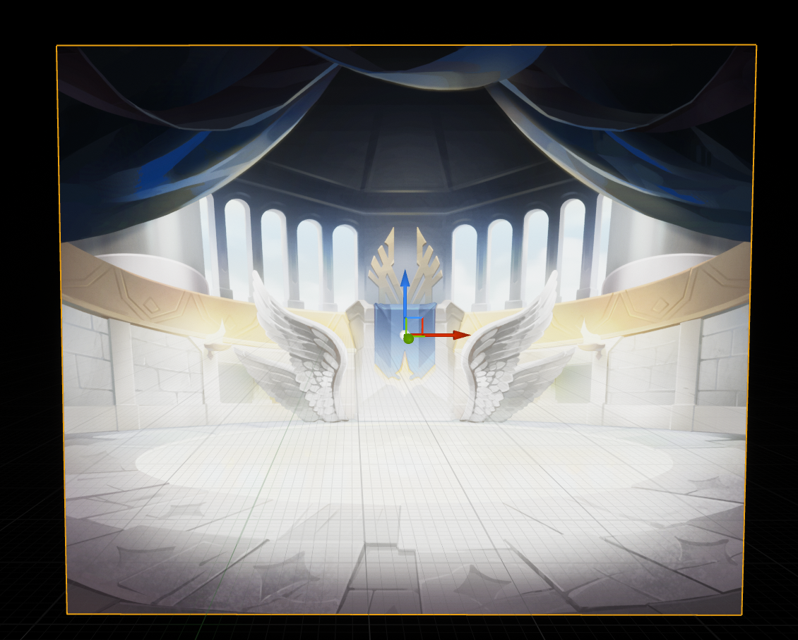

 

### PostProcessVolume을 통해 후처리로 이미지의 뽀샤시한 효과를 없앨 수 있다

 

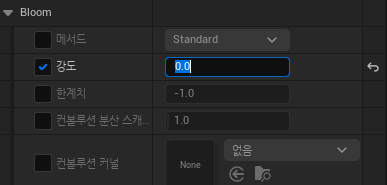

- Bloom의 Intensity를 0으로

 

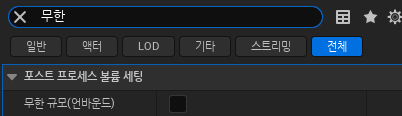

- Infinite Extent 활성화로 레벨 전체에 영향을 줄 수 있다

 

## FlipBook

- Sprite들을 합쳐서 애니메이션처럼 보이게 하는 방법
- Sprite들을 선택하고 우클릭 -> Create FlipBook

 

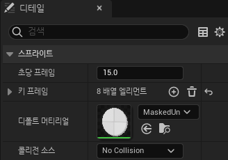

- 초당 프레임으로 애니메이션의 속도를 설정할 수 있다

 

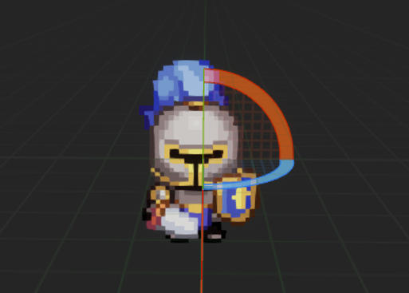

- BluePrint -> PaperFlipBookActor 생성으로 FlipBook 블루프린트 클래스를 만들 수 있다

 

## PaperCharacter

 

### 카메라 만들기

 

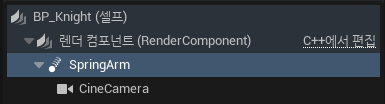

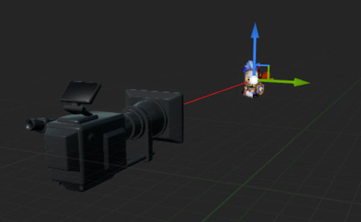

- 셀카봉 같은 Spring Arm에 카메라를 달아서 사용한다

 

### Window -> 월드 세팅 -> 게임모드

 

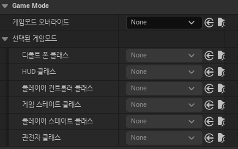

- Player Controller를 통해 액터를 조종할 수 있다

 

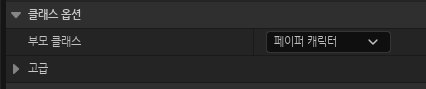

- 클래스 세팅에서 부모 클래스를 PaperCharacter로 변경

 

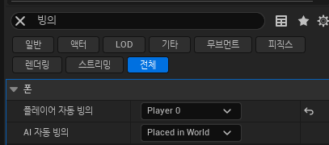

- Auto Possess Player를 Player0으로 세팅
- 게임이 시작되면 Player Controller 0번이 자동으로 빙의되도록 설정해준다
- Player Controller 0번은 Local Controller 즉, 자신이다

 

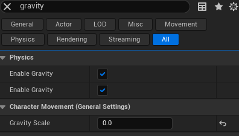

- Gravity Scale을 통해 캐릭터가 아래로 떨어지지 않도록 할 수 있다
- 빙의를 통해 Control하기 위해선 Pawn, 물리 영향까지 받기 위해선 Character을 상속해야한다