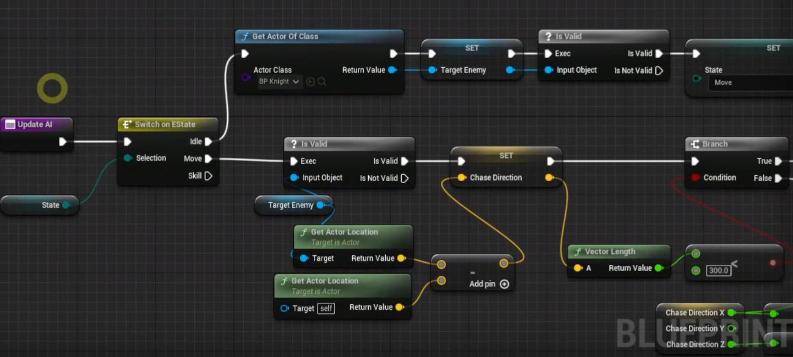
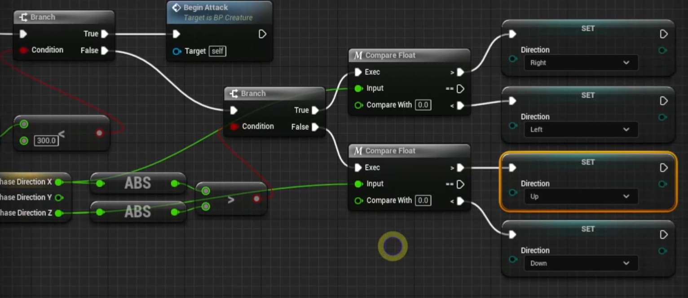
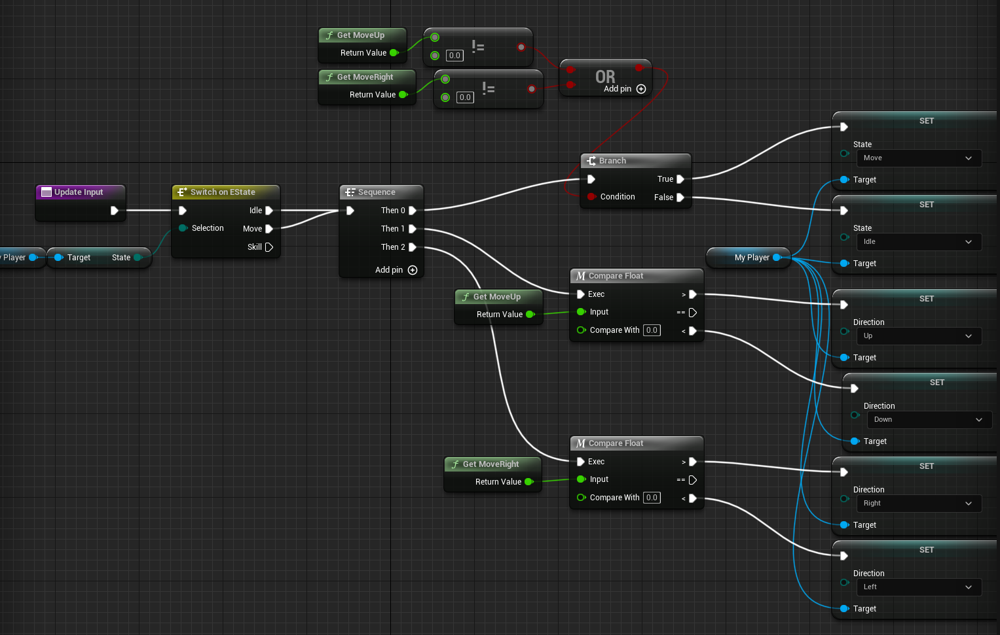

# 인공지능과 컨트롤러

 

## FSM(Finite-State Machine) 유한 상태 기계

- 유한 오토마타라고도 불리며 컴퓨터 프로그램과 전자 놀리 회로를 설계하는 데에 쓰이는 수학적 모델로 상태 기계라고 부르기도 한다
- 유한한 개수의 상태를 가질 수 있는 오토마다이다
- 한 번에 하나의 상태만을 가지게 된다.

 

### Monster 클래스에 UpdateAI 함수 추가

 

1. 맵에 존재하는 모든 Knight 클래스 찾기
2. Null Check를 진행 후 존재한다면 Move State로 변경
3. Move 상태인 몬스터가 존재한다면 Knight 방향으로의 방향 벡터를 구한다
4. Vector Length, 몬스터와 Knight의 거리가 공격 범위 보다 작다면 공격 실행
5. 공격 범위보다 크다면 즉, 멀리 있다면 더 먼 방향으로 이동한다

 

## Controller 

- GameMode Blueprint 클래스 만들기
- PlayerController Blueprint 클래스 만들기
    - Knight에 있는 UpdateInput을 구현하여 관리한다
- AIController Blueprint 클래스 만들기
    - Monster의 AI를 구현하여 관리한다

 

### GameMode Override를 생성한 GameMode Blueprint 클래스로 설정한다

 

- Default Pawn 클래스를 Knight로 설정
- Player Controller 클래스를 새로 생성한 Player Controller 클래스로 설정

 

### PlayerController의 UpdateInput

 

 

### Get Controlled Pawn을 통해 Player Controller를 받아온 다음 Knight로 캐스팅 해준다

 

- My Player라는 변수로 Knight로 캐스팅된 Controller를 관리하여 UpdateInput에서 사용할 수있다

 

### Player Controller에서 입력을 관리하기 때문에 Knight에서 UpdateInput은 필요 없다

 

 

### Monster의 AI Controller 클래스를 새로 생성한 AIController 클래스로 설정

 

 

### Get Controlled Pawn을 통해 Player Controller를 받아온 다음 Monster로 캐스팅 해준다

 

- My Player라는 변수로 Monster로 캐스팅 된 Controller를 관리하여 UpdateAI에서 사용할 수 있다

 

### AIController의 UpdateAI

 

