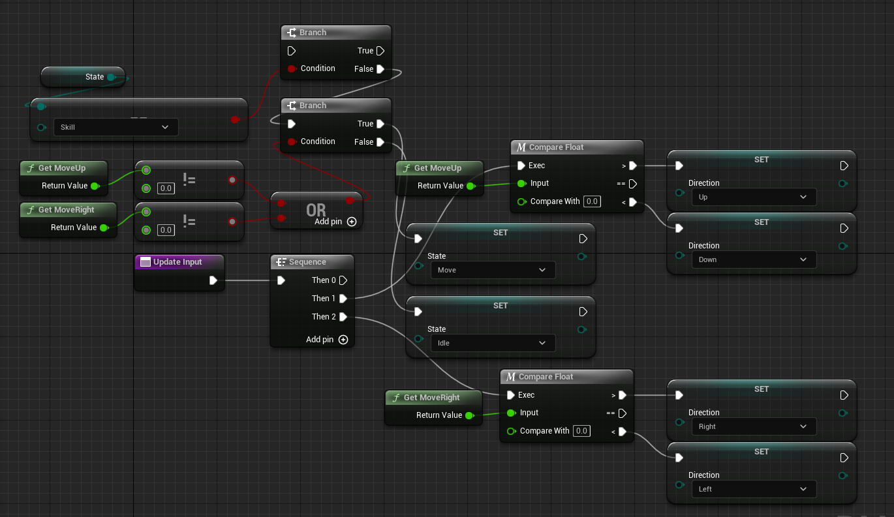

# 애니메이션 관리

 

## 입력 매핑

 

### Source FlipBook을 설정하는 Set FlipBook

 

 

### WASD로 방향에 따른 FlipBook의 변환

 

- Side Idle 상태에서 서로 반대편을 바라보기 위해 A와 D 입력의 Z Rotation이 180도 달라야 한다

 

### WASD 키보드 이벤트 보다는 Axis Mapping을 이용하는 것이 좋다

 

 

### AxisMapping을 통한 WASD의 입력 매핑

 

 

## 매크로

 

### 더 간편하게 비교하는 Compare[Type] 매크로

 

 

### 블루프린터 에디터 좌측의 매크로 추가하기

 

 

### 함수 VS 매크로
- 매크로는 그저 만들어둔 코드를 복사해서 붙여넣는 것이다
- 함수는 블루프린트 클래스를 상속받은 경우 오버라이딩을 할 수 있다
- 매크로는 Delay 처럼 노드의 실행 흐름을 늦출 수 있지만 함수는 한 번 실행되면 끝까지 지연 없이 실행되어야 한다

 

## 애니메이션 갱신

 

### EDirection 추가

 

 

### Enum과 함수를 통한 애니메이션 갱신

 

 

### 키보드 입력을 알 수 있는 방법

 

 

### 움직임과 Idle을 동시에 구현하기

 

 

## 공격 애니메이션

 

### 입력 이벤트 리팩토링

 

- UpdateInput 함수 추가

 

### Action Mapping 추가하기

 

 

### 공격 애니메이션 추가하기

 

- 하지만 이렇게 되면 공격 애니메이션이 멈추지 않게 된다

 

### FlipBook의 길이를 알 수 있는 Get FlipBook Length

 

- FlipBook의 길이만큼 Delay한 후에 bAttack을 False로 만들어준다면 1회 공격 후 애니메이션이 멈추게 된다

 

## State 패턴

 

### 값에 따라서 옵션을 설정해주는 Select

 

- Select를 통해 코드를 간략하게 만들 수 있다

 

### ***모든 상태를 Boolean 변수로 관리하다 보면 너무 많아지게 돼 관리가 힘들어진다***

 

### EState 만들기

 

 

### EState를 통해 함수 바꾸기

- Select와 Enum을 통해 코드를 간략하게 만들 수 있다