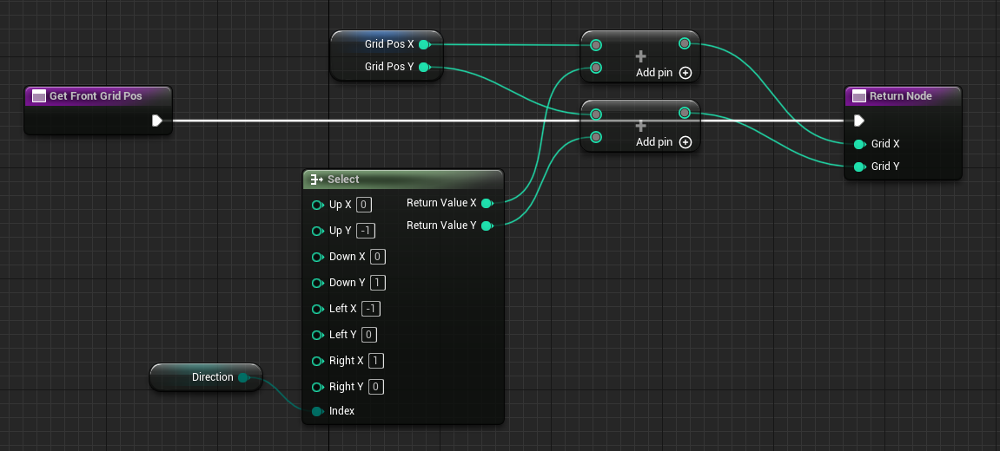
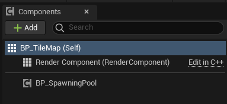

# 구조와 설계

 

## 매니저

 

### UE5 Architecture

 

- GameMode는 매니저 역할을 하기 가장 적합한 클래스이다

 

- 레벨이 바뀌게되면 기존 레벨에서의 세팅해둔 데이터가 날라갈 수 있다
- 게임을 킨 순간부터 계속해서 유지되는 데이터를 관리하기위해 GameInstance 블루프린트 클래스를 만든다
- 프로젝트 설정 -> Maps & Modes의 GameInstance를 새로 만들어준 GameInstance 클래스로 선택한다

 

### 클래스에 종속되지 않는 Static 함수들을 관리하는 Blueprint Function Library 생성

 

- Function Library에 만들어둔 GameInstance로 캐스팅 해서 반환하는 Get BP GameInstance 함수추가

 

### TileMap을 찾아서 반환해주는 Get BP TileMap 함수 추가

 

- 두 함수 모두 연산이 없는 반환이기 때문에 순수 함수로 만들어준다

 

### 바라보는 방향의 바로 앞 좌표를 반환하는 Get Front Grid Pos 함수 추가

 

- 자주 사용되는 기능은 함수로 빼서 관리하는 것이 좋다

 

## UI와 HUD

 

### Creature의 OnDead 함수

 

- UI와 데이터는 분리하는 것이 좋다

 

### Function Library에 만들어둔 GameMode로 캐스팅해서 반환하는 Get BP GameMode 함수 추가

 

- BP GameMode에 KillCount 변수 추가

 

### Creature의 OnDead 함수 추가

 

- BP GameMode의 KillCount를 증가시킨다

 

### GameUI의 Get Kill Count Text 수정

 

 

### ***Widget Blueprint는 UMG(Unreal Motion Graphics)로 HUD Class에 비해 모던한 방식이다***

 

### HUD Class 추가

 

- HitBox를 만들어 커서가 HitBox에 올라가고 내려올 때에 대한 이벤트를 만든다

 

## Component

 

### 몬스터의 자동 스폰을 관리하는 Actor Component SpawningPool 추가

 

- TileMap에 Spawning Pool 추가

 

### SpawningPool에 Actor Component의 Owner를 가져오는 Get Owner 추가

 

- TileMap으로 캐스팅해준 후 변수로 관리한다
- 이후 Update Random Creature 이벤트를 호출한다

 

### Creature를 랜덤으로 스폰하는 Update Random Creature 이벤트 추가

 

 

### TileMap의 Despawn Creature 수정

 

- Actor Component의 On Despawn Creature를 호출하여 Creature의 수를 조절한다

 

### On Despawn Creature 함수

 

