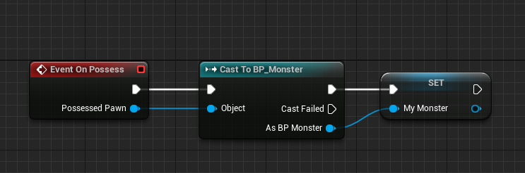
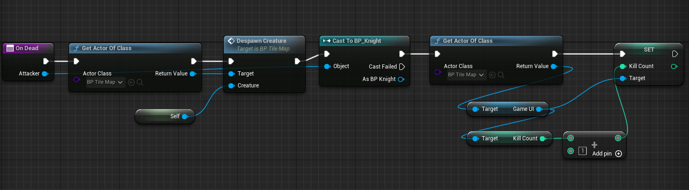
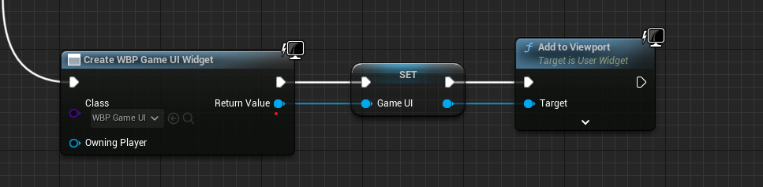

# 게임 컨텐츠

 

## 몬스터 스폰

 

### TileMap에 랜덤으로 비어있는 타일을 찾는 Get Random Empty Grid Pos 추가

 

 

### TileMap에 몬스터를 스폰하는 Spawn Creature 함수 추가

 

- Creature를 인자로 전달받아 Spawn Actor에 전달한다

 

### TileMap에서의 Spawn Creature

 

 

### Creature의 Set Destination 수정

 

- 생성되는 몬스터와 Knight의 y축을 500으로 고정해준다
- 몬스터와 Knight의 y축을 타일 맵의 y축 즉, 0으로 해주면 맵과 겹치는 버그가 생길 수 있다

 

## 유닛 충돌

- Collision Box를 없애고 앞 타일에 몬스터가 있으면 피격하는 방법으로 변경
- TileMap에 Creatrue Array 생성

 

### Spawn Creature 이후에 Creature Array 추가

 

 

### 특정 위치에 Creature가 있는지 여부를 반환하는 Get Creature At Grid Pos 추가

 

 

## Get Creature At Grid Pos를 이용해서 Can Go 함수 수정

 

- 몬스터가 있는 공간인지 한번 더 확인한다

 

### Creature의 Process Attack 함수 수정

 

- Grid Pos를 통해 다음 좌표(타일)에 몬스터가 있으면 OnDamaged 함수를 호출한다

 

## 몬스터 AI

 

### Monster의 Pawn -> Auto Possess AI를 Placed In World Or Spawned로 변경

 

- 만들어준 AI Controller를 사용한다는 의미이다

 

### AI Controller에 Event On Possess 추가

 

- 추가하지 않는다면 AI Controller가 가르킬 대상이 없어 Null Crash가 발생한다

 

### AI Controller의 UpdateAI 수정

 

 

### Creature에 대상까지 가야하는 타일을 계산하는 Get Tile Count To Target 추가

 

 

### Creature에 대상을 바라보는 Look At Target 함수 추가

 

 

### Monster의 Update Destination을 Override

 

 

## 몬스터 디스폰

 

### TileMap에 몬스터를 소멸시키는 Despawn Creature 추가

 

 

### Creature의 Ondamaged 수정

 

- 체력이 0보다 작거나 같으면 OnDead 함수 호출

 

### Creature에 몬스터가 죽었을 때 실행하는 OnDead 함수 추가

 

- Creature 타입마다 죽은 이후의 흐름이 달라질 수 있기 때문에 Override 할 수 있게 새로운 함수로 만들어준다

 

### KillCount를 표시 할 Game UI Blueprint 클래스 추가

 

- Palette -> Canvas Panel 추가
- Canvas Panel을 추가하면 도화지처럼 Text, Button 등을 추가하기 용이하다

 

### KillCount를 표시 할 Text Block 추가

 

 

### KillCount를 표시 할 Get Kill Count Text 함수 Binding

 

- Kill Count를 변수로 만들어 가지고 있는다

 

### TileMap의 BeginPlay에서 Widget을 생성하고 ViewPort에 추가하기

 

 