# 이동과 전투

 

## Set Actor Location

 

### 공격 중에 방향이 틀어지는 것을 방지하기 위해 Skill 상태가 아닐 때만 실행하도록 변경

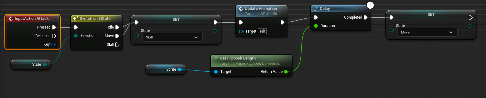

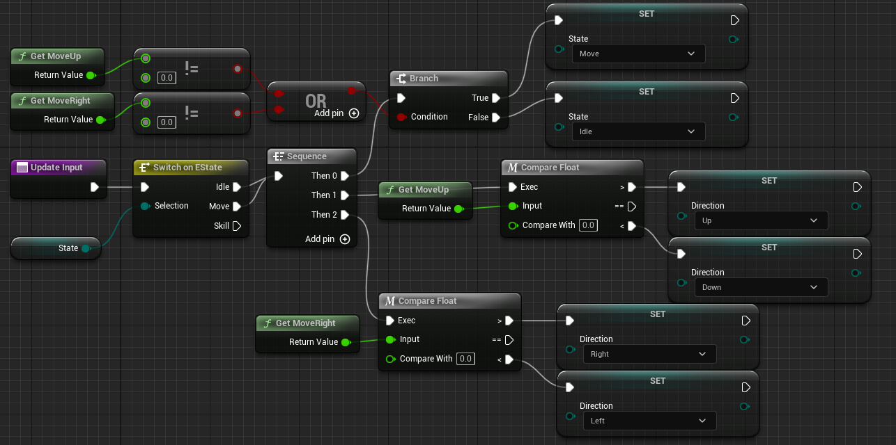

- 상태에 따라서 코드를 만들게 되면 관리하기가 수월해진다

 

### 캐릭터의 움직임을 개선하는 UpdateLogic 추가

 

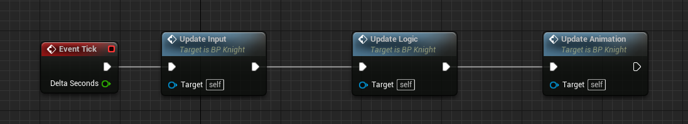

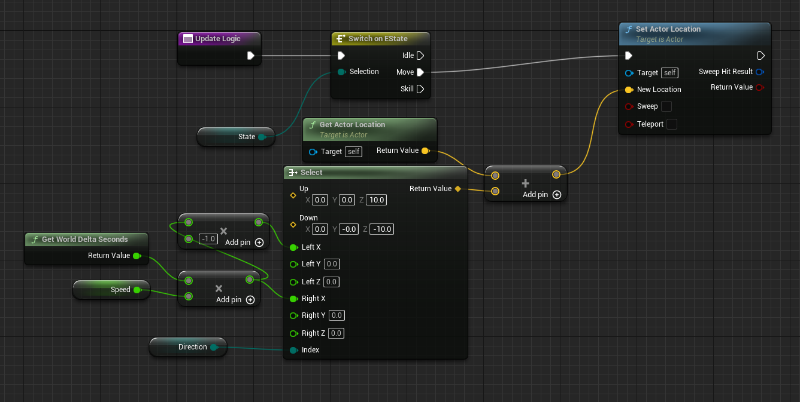

- Sweep: 가는 길에 Actor와의 충돌을 감지해 뚫고 지나가지 못하게 한다
- Set Actor Location은 복잡한 물리 연산을 할 수 없다
- 복잡한 이동이 필요한 경우에는 Character Movement를 사용하면 된다

 

## Character Movement

- 이동과 관련된 로직은 Movement Component를 사용하는 것이 좋다
- 다양한 상황(걷기, 수영, 비행)에서 처리하기 간편하다

 

### Add Movement Input을 통한 이동 방향 정하기

 

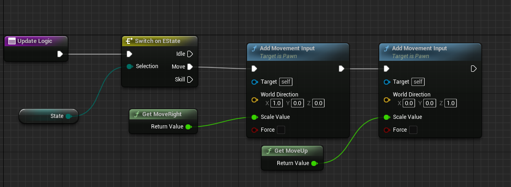

- Default Land Movement Mode를 Flying으로 하고 Breaking Deceleration Flying을 2048000으로 하면 움직임이 미끄러지지 않고 상하좌우로 움직일 수 있다

 

## 상속 구조 설계

 

### 새로운 블루프린트 클래스인 Creature 만들기

 

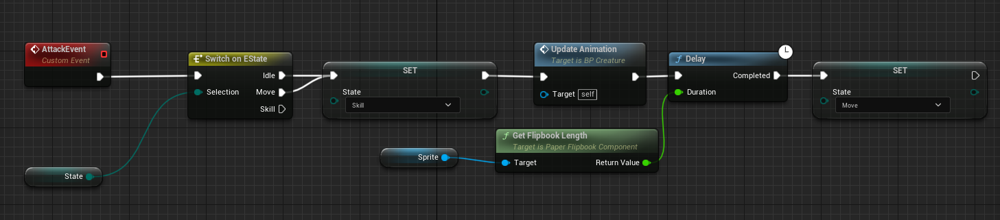

 

### Creature를 상속받은 Knight 클래스

 

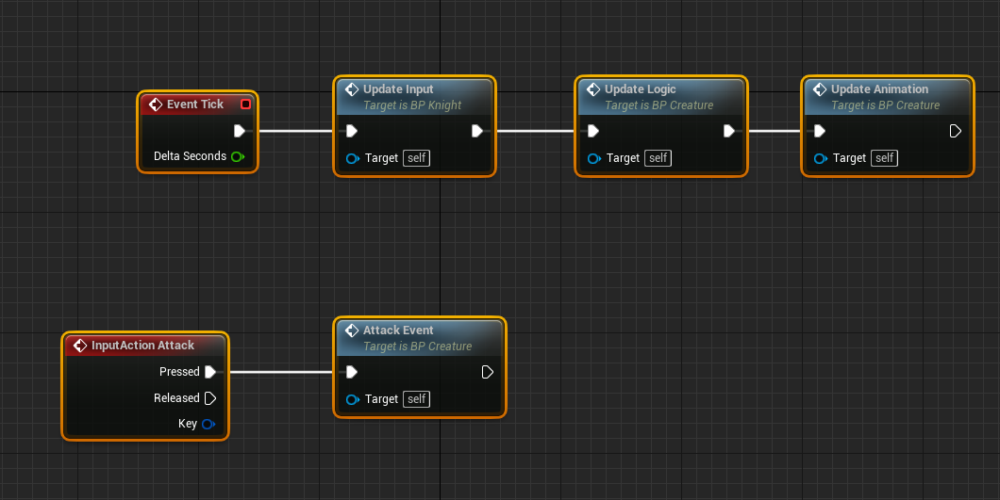

- 부모 클래스의 Attack Event를 그대로 사용한다

 

### Creature를 상속받은 Monster 클래스

 

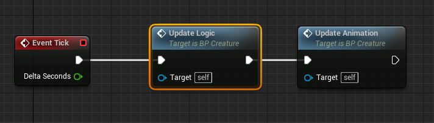

 

## DataTable

 

### CreatureData 구조체 생성

 

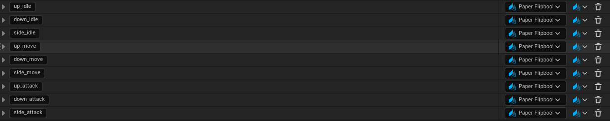

 

### 우클릭 -> Miscellaneous(다양한 것)의 Data Table 생성

 

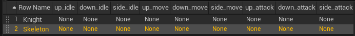

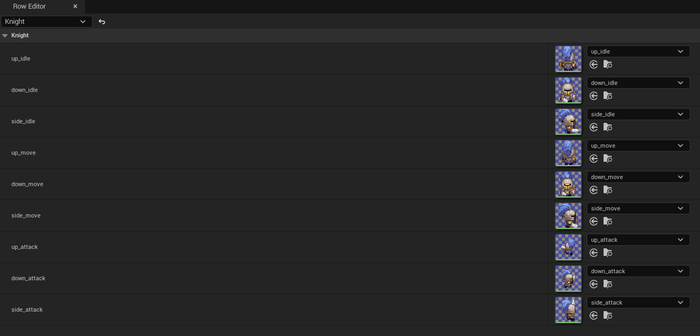

 

### DataTable을 통해 데이터를 관리하는 것의 장점

1. 데이터와 코드를 구분할 수 있다
2. 코드에서 데이터 테이블을 참조하여 사용할 수 있다

 

### DataTable을 참조하는 Get Data Table Row

 

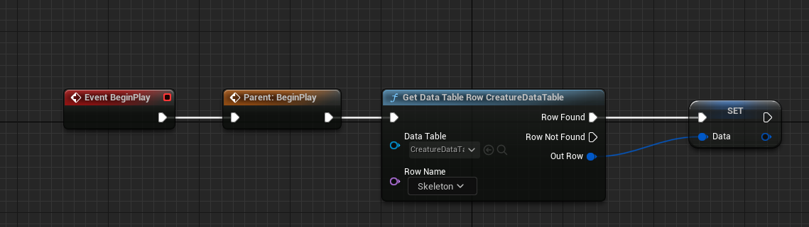

- 이벤트, 함수 우클릭 -> Add Call To Parent Function을 통해 부모 클래스의 함수를 호출 할 수 있다
- 공통적인 부분을 부모 클래스의 함수에 구현하고 추가적인 부분을 자식 클래스에서 구현하면 된다

 

###  DataTable을 통한 Update Animation 구현

 

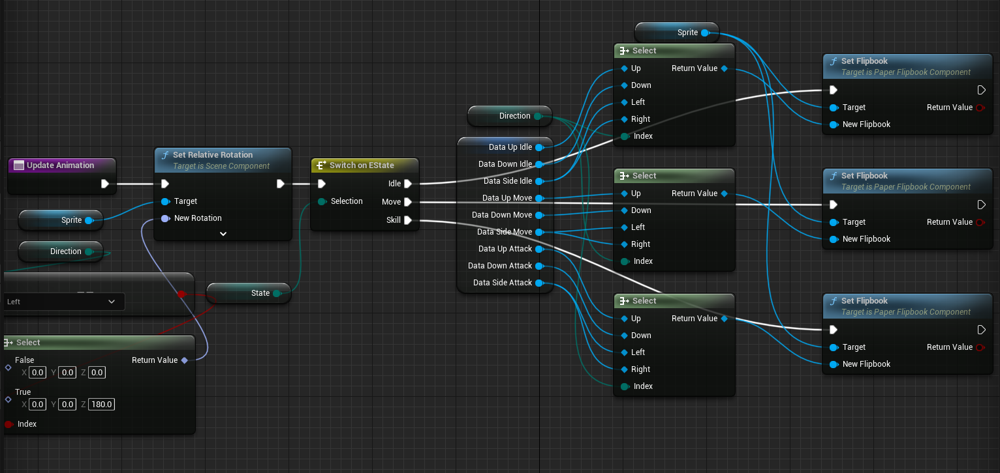

 

## 피격 판정

 

### 공격 범위의 Box Collision 추가

 

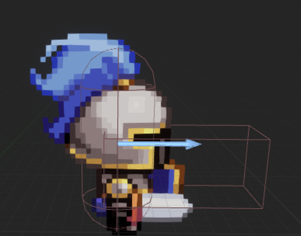

- Box Collision을 Sprite 오브젝트 아래에 두어야 같이 움직인다

 

### 피격 판정을 하는 Process Attack 추가

 

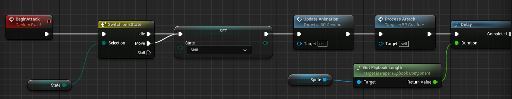

 

### Overlapping 되어 있는 Actor를 가져오는 Get Overlapping Actors

 

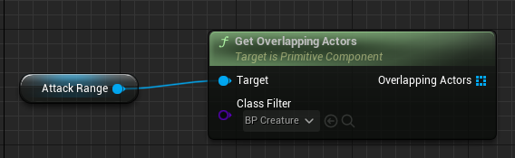

- 필터를 통해 해당 클래스의 Overlapping만 파악할 수 있다

 

### 데미지를 받는 함수는 데미지를 받는 오브젝트를 기준으로 만드는 것이 좋다

 

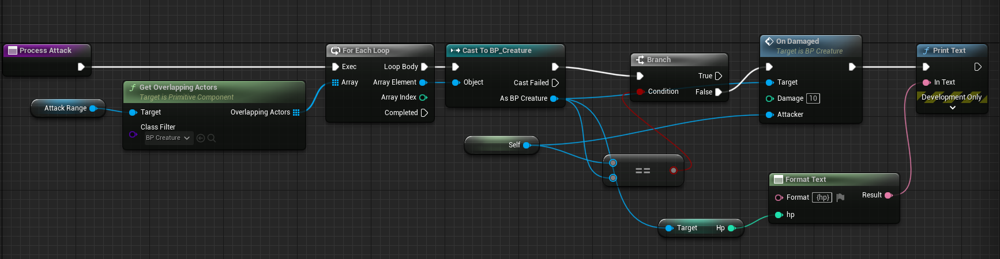

- For Each 문의 Output은 Actor이기 때문에 BP_Creature로 캐스팅 해주어야 한다
- 함수를 실행할 때 공격자의 정보 및 데미지 등을 인자로 전달한다
- 자기 자신한테는 데미지를 주지 않도록 예외처리를 한다

 

### 데미지를 받는 OnDamaged 함수 추가

 

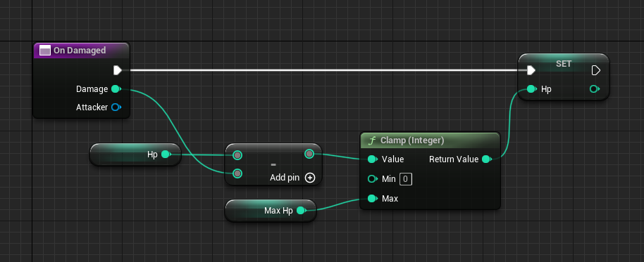

- Clamp 함수를 통해 Min(0), Max(MaxHp) 사이의 값을 반환한다

 

### Hp와 MaxHp 설정은 부모클래스에서 진행한다

 

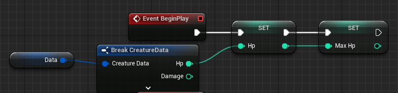

 

### Knight와 Skeleton 클래스에서 부모 클래스의 함수를 호출하여 똑같이 Hp를 설정한다

 

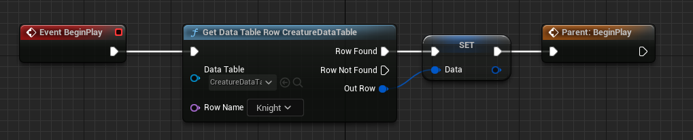

 

### EventTick 또한 부모클래스로 옮기고 자식 클래스에서 호출한다

 

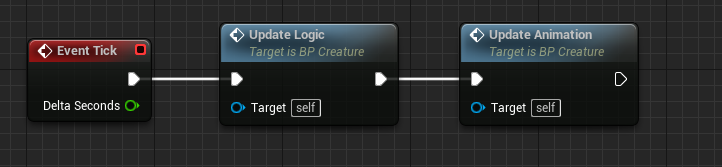

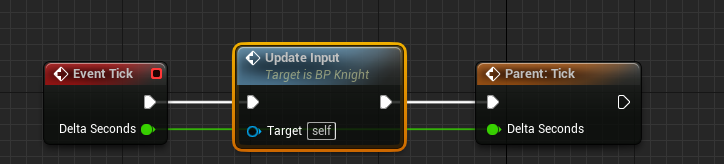

 

## 체력 게이지

 

- 우클릭 -> User Interface -> Widget BluePrint -> User Widget 추가
- UI를 다룰 수 있는 블루프린트이다
- Screen -> Custom -> Width 200, Height 25

 

### Progress Bar 생성

 

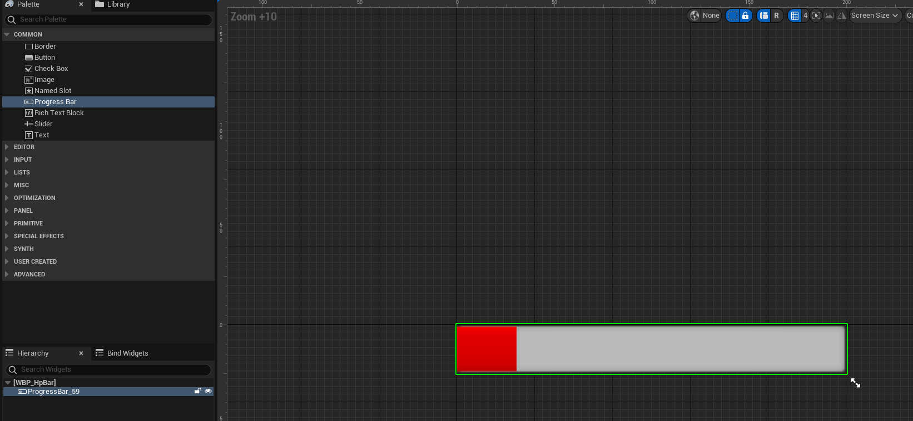

 

### RGB를 통해 색을 변경할 수 있다

 

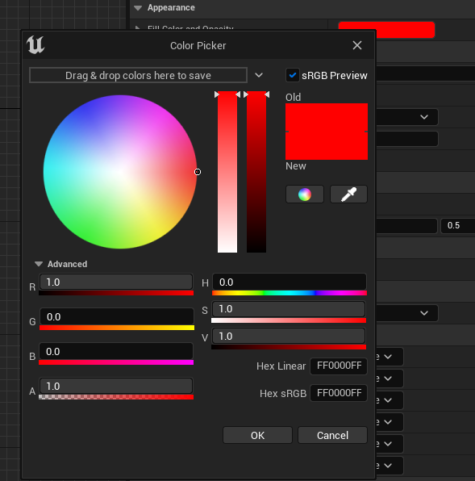

 

### Creature에 Widget 추가

 

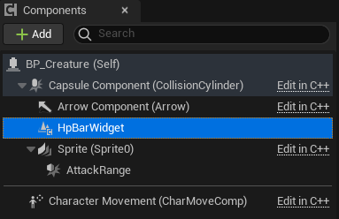

 

### Widget Class를 선택하고 Draw Size를 설정

 

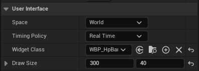

 

### Widget을 가져오는 Get User Widget Object

 

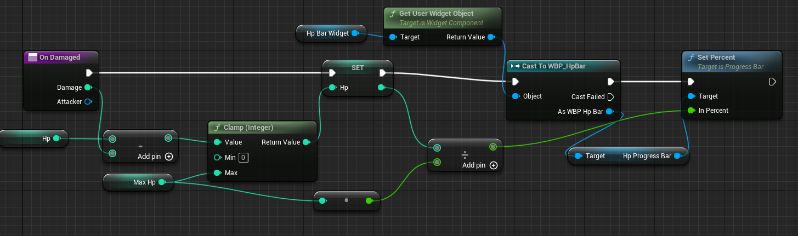

- 해당 Widget 클래스로 캐스팅 해주어야 한다
- Set Percent를 통해 Hp Progress Bar의 Percent를 설정할 수 있다
- 해당 과정들도 함수로 관리하는 것이 코드 관리 차원에서 좋다

 

### Binding을 통해 Percent를 관리할 수 있다

 

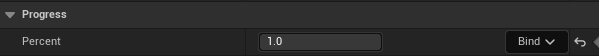

 

### Binding은 함수 또는 변수로도 가능하다

 

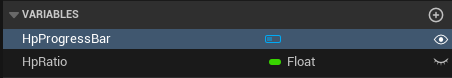

 

### 바인딩된 변수 HpRatio를 통해 ProgressBar의 Percent 설정하기

 

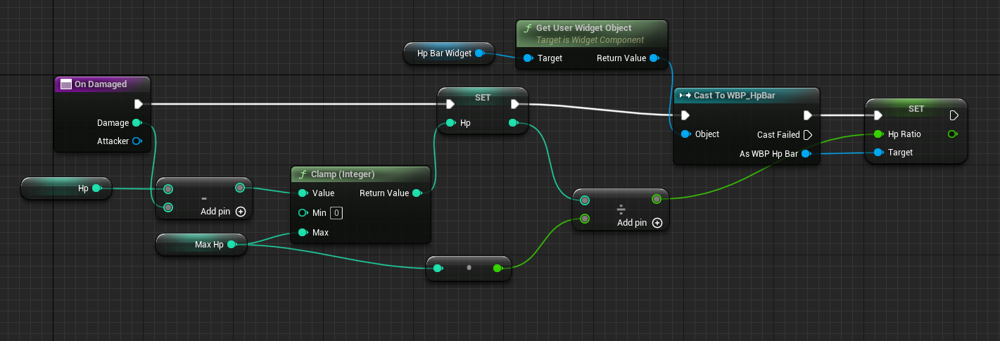

