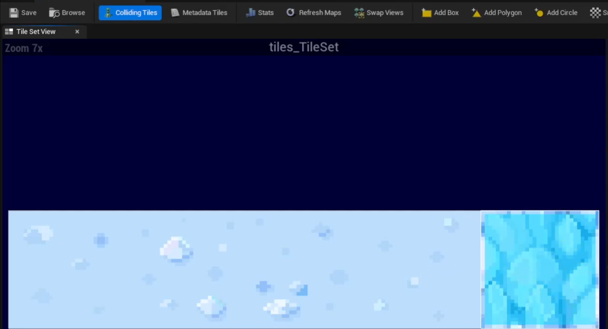

# 타일맵

 

## 타일맵

- Tile Texture를 Paper 2D Texture로 만들어준 후 Create Tile Set으로 Tile 생성
- 우클릭 -> Paper2D -> TileMap 생성

 

### Active TileSet을 만들어둔 Tile Set으로 설정

 

 

### 해당 타일 셋으로 타일 맵의 한 타일을 설정할 수 있다

 

 

### fill을 통해 타일 맵을 모두 채울 수 있다

 

- 타일 셋의 벽을 선택 후 타일 맵을 클릭하여 벽으로 모두 채운다

 

### Paint를 통해 맵의 나머지 부분을 채운다

 

 

### 타일 맵을 레벨에 배치하여 맵으로 사용할 수 있다

 

 

### Tile Layer List를 통해 탕리 맵을 층 별로 관리할 수 있다

 

 

### 카메라 세팅에서 원금감을 배제하는 법

 

- Orthographic(직교 투영)을 통해 모든 오브젝트를 동일한 크기로 볼 수 있다
- Ortho Width를 통해 카메라가 보여지는 크기를 조절할 수 있다
- Perspective는 원근감을 표현하는 모드

 

## 타일 충돌

- Blocking Volume으로 일일이 충돌 영역을 만들어주기에는 너무 복잡하기 때문에 Tile Set의 Collision을 추가해서 충돌 영역을 만들어줄 수 있다

 

### Add Box를 통해 벽 부분에 충돌 영역을 만들어준다

 

- Colliding Tiles를 활성화하면 충돌 영역이 있는 부분을 보여준다

 

### TileMap의 Collision 옵션에서 Collision Thickness를 통해 충돌 두께를 설정할 수 있다

 

 

## 타일맵 정보 추출

- PaperTileMap Blueprint 클래스 생성

 

### Render Component의 Tile Map 등록

 

 

### 타일에 대한 정보를 반환하는 Get Tile

 

 

### Boolean 배열을 통해 갈 수 있는 타일인지 여부를 입력하기

 

 

### Idx가 76이라면 %10한 것이 x좌표, /10 한 것이 y 좌표가 된다

 

 

### 갈 수 있는 타일인지 구분하기

 

- Idx를 구하는 것은 반대로 y 좌표에 10을 곱하고 x좌표를 더한 것이 된다

 

## 타일 좌표 구하기

 

### 타일맵의 좌표를 idx로 변환해주는 Grid Pos to Index 함수 추가

 

- In Range 함수를 통해 좌표의 유효범위를 확인할 수 있다
- Inclusive를 통해서 범위를 포함할지 여부를 정할 수 있다

 

### 타일 맵의 Width와 Height를 변수 MapWidth와 MapHeight에 저장해서 사용한다

 

 

### Grid Pos To Index를 통한 Can Go 함수조정

 

 

### 타일의 위치로부터 월드 좌표를 구하는 Get Tile Pos

 

- MaxSize는 타일 한 칸의 크기 32px이다.
- Tile의 x, y축의 좌표에 타일 크기(32)와 스케일(5)를 곱해주어야 한다

 

### 기준점이 되는 위치를 기준으로 Get Actor Location을 호출해 더해주면 된다

 

 

### Knight 클래스에서 타일 맵의 액터를 가져와 Get Tile Pos 함수를 호출하고 해당 좌표로 Knight를 Set Locatoin을 통해 타일 단위로 이동할 수 있다

 

- Get Tile Pos 함수는 내부에서 수정하는 것이 아니라 단순히 연산한 결과를 반환하는 것이기 때문에 Pure 속성을 체크해주면 된다

 

### 하드 코딩으로 (4, 5) 시작 위치로 설정해주고 있다

 

- 순수 함수의 경우 함수의 색이 초록색이다

 

## 타일 단위 이동

 

### 새로운 구조체 EGridPos 추가

 

- Creature에 EGirdPos 구조체 변수 추가
    - 해당 변수를 통해 타일 맵의 좌표로 이동한다
- Creature에 목적지를 설정하는 SetDestinatino 함수 추가

 

### SetDestination을 이용한 Knight의 시작 위치 설정

 

 

### Creature에 목적지에 도착했는디 여부를 반환하는 HasArrivedToDest 함수 추가

 

 

### Creature의 UpdateLogic 수정

 

- 도착을 했다면 다음 목적지를 구하고 -> UpdateDestination 호출
- 도착을 못했다면 이동시킨다 -> Add Movement Input 호출

 

### Creature에 입력하는 값에 따라서 목적지를 갱신하는 UpdateDestination 추가

 

- Direction을 타일 맵의 좌표로 구해야하기 때문에 EGridPos로 선택 후 Split
- StopMove 변수를 통해서 False라면 움직이도록 설정해 키보드 입력이 없으면 바로 멈추도록 설정한다

 

### Player Controller의 Update Input 수정

 

- 목적지에 도착하지 못했다면 계속해서 이동해야되기 때문에 Has Arrived To Dest 함수를 호출하여 도착하지 못했으면 계속해서 Move 상태로 설정한다
- 키보드 입력이 없다면 StopMove를 False로 설정
