# 자료구조

 

## Array

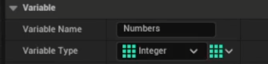 
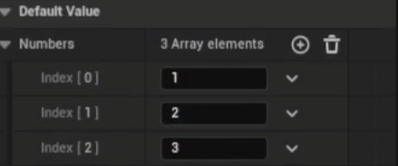

- 변수의 Variable Type을 Array로 지정
- UE BluePrint의 Array는 동적 배열로 동작한다

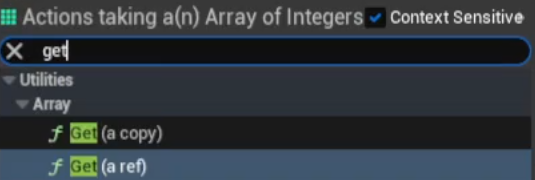

- 배열의 get은 복사와 참조 두 가지 방법이 있다

### For Loop를 이용한 배열의 Get

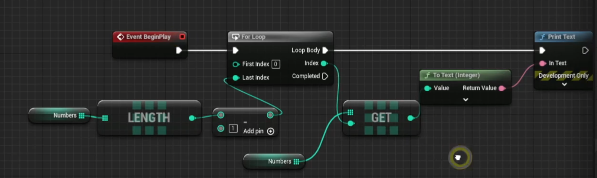

### For Each Loop를 이용한 배열의 Get

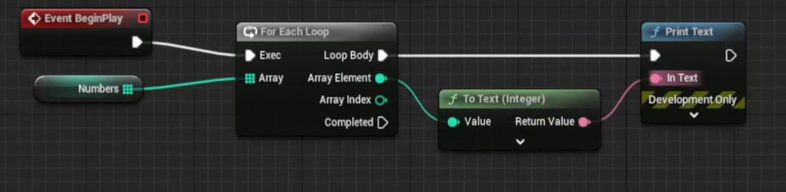

### Add와 Add Unique

- Add: 배열에 요소 추가
- Add Unique: 배열에 중복되지 않으면 요소 추가

### Find와 Contains

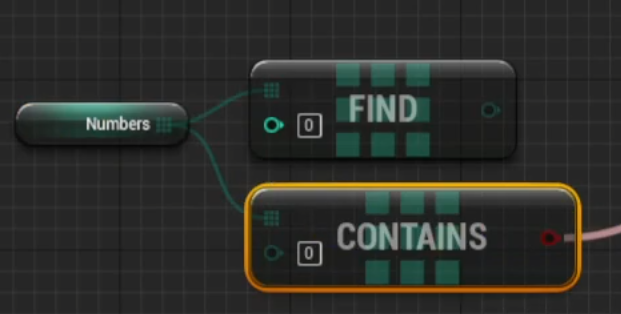

- Find: 찾고 싶은 데이터의 idx를 반환, 없을 시 -1 반환
- Contains: 찾고 싶은 데이터의 유무를 Boolean Type으로 반환

### Resize

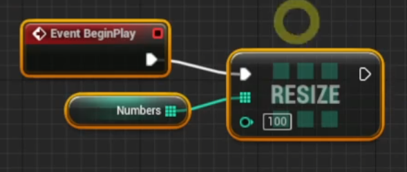

- Resize를 통해 배열의 크기를 조절할 수 있다

### Set

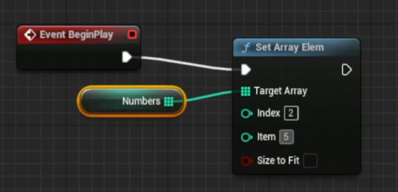

- idx에 해당하는 값을 Item으로 초기화한다
- Size to Fit을 사용하면 idx보다 size가 작을 경우 size를 늘려서 동작시킨다

 

### 연습 문제: 로또 번호 생성기

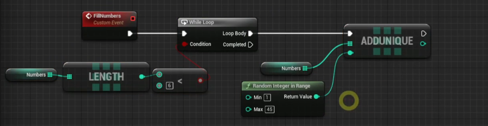 
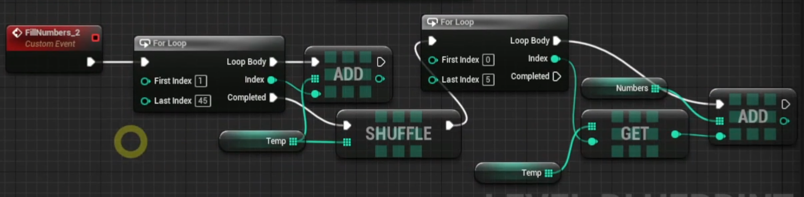

### 연습 문제: 버블 정렬

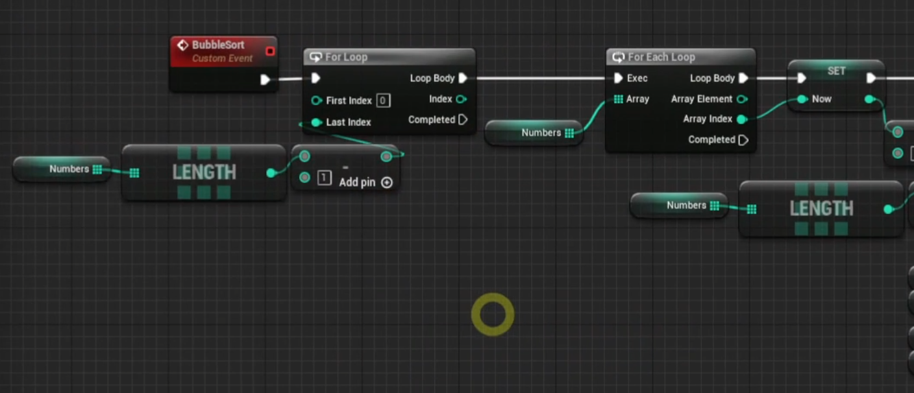 
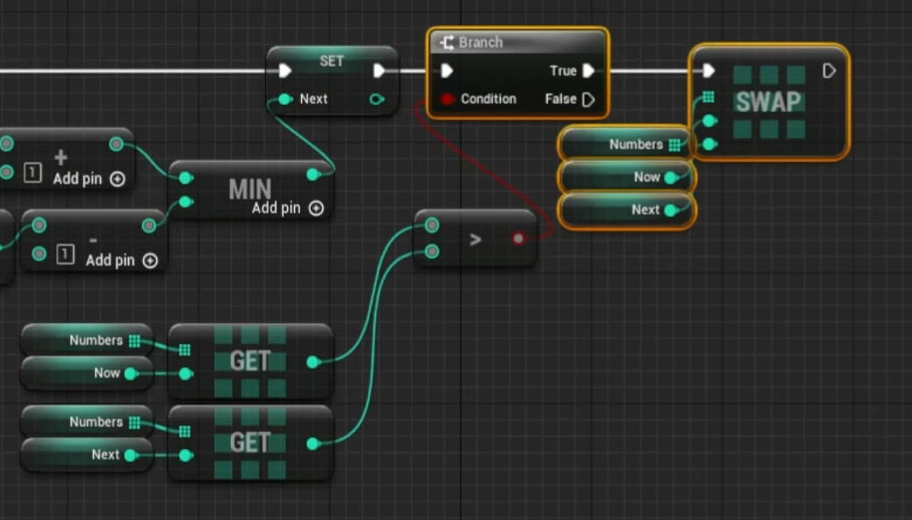

## Hash Table, Map

 

### Hash Table
- Variable Type: Map
- Key 값을 통해서 데이터에 빠르게 접근할 수 있다

 

### Map
- Key와 Value로 이루어진 데이터 타입

 

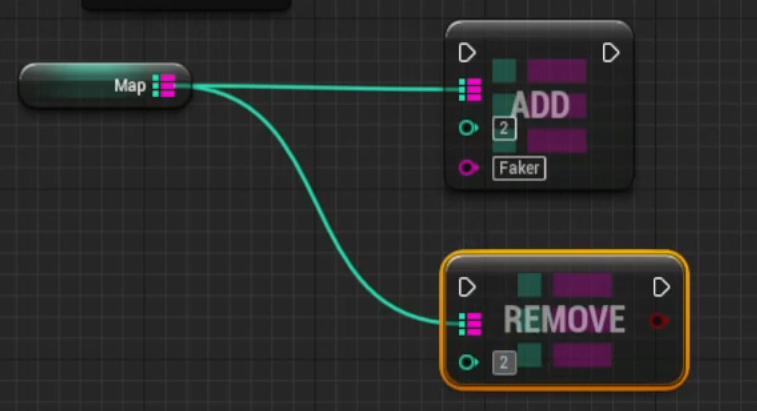

- Add: Key와 Value 전달
- Remove: Key만 전달