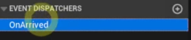

# Event Dispatcher 

- 이벤트 디스패처란, 이벤트를 정의하는 것과 통지하는 것을 함께 해결하는 방법이다

 

- 블루프린터 에디터 좌측의 이벤트 디스패처 추가

 

### Assign을 통한 이벤트 디스패처 바인딩

 

 

 

### 이벤트 디스패처를 호출하고 해당 액터(self)를 인자로 전달해야 한다

 

 

### 이벤트 디스패처를 통해 만든 슬라임 경주

 

- 더이상 이벤트가 발생하지 않는다면 해당 이벤트 디스패처를 Unbind를 통해 Binding을 해제해주는 것이 좋다

