# 흐름 제어

 

## Branch, Sequence, Flip Flop

 

### Branch
- 조건에 대한 True, False에 따라서 분기하여 실행된다
- 댠축키: B + 좌클릭

### Sequence

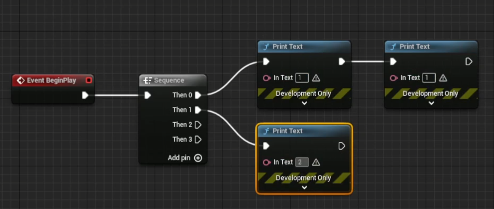

- 코드를 순서대로 실행한다

### Flip Flop

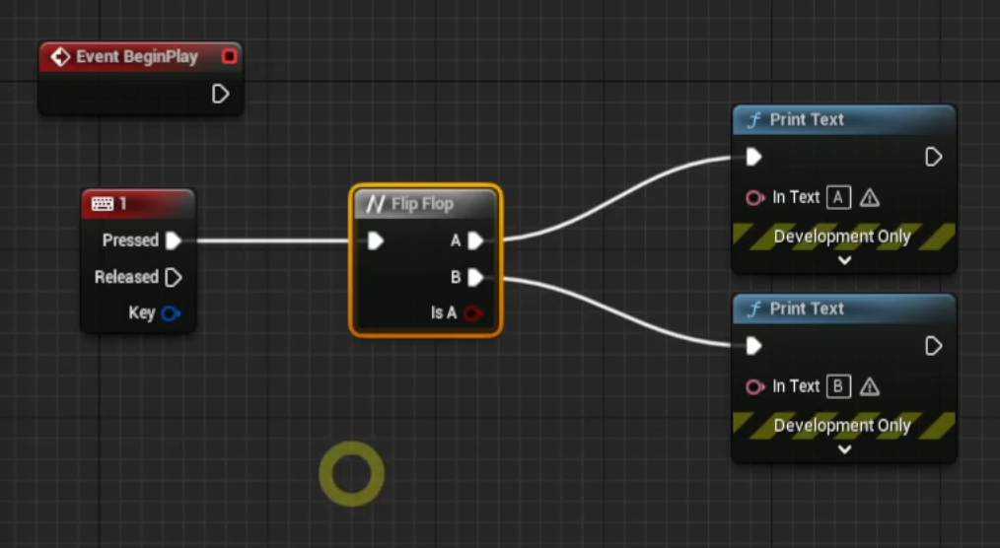

- 코드가 번갈아가면서 실행된다

## Min, Max, Clamp

 

### Min

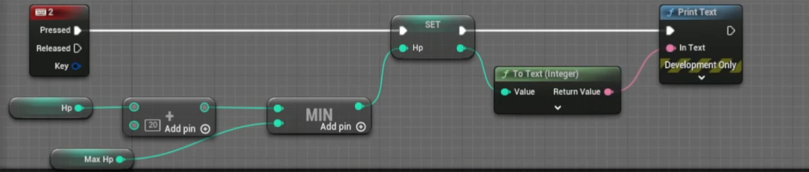

### Max

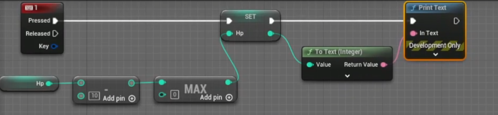

### Clamp

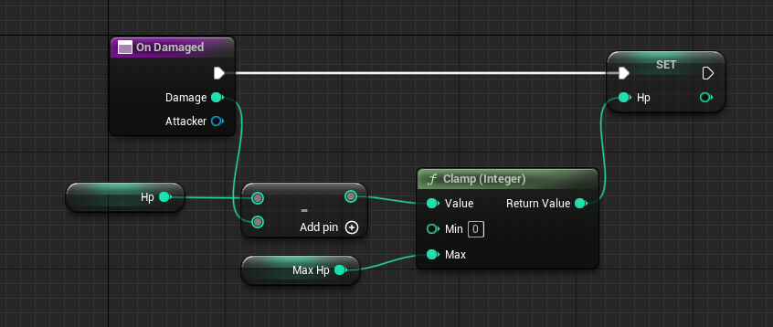

- min, max 값을 넘어서지 않도록 한다

 

## For Loop, While Loop

### For Loop

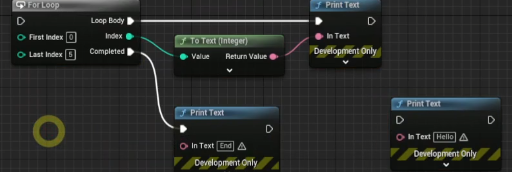

### While Loop

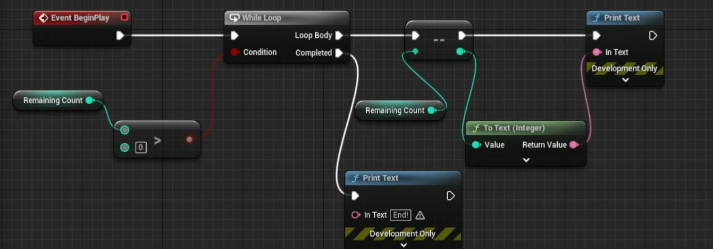

### For Loop With Break

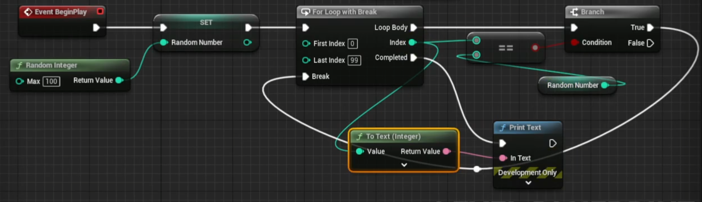

 

### 연습문제: 구구단

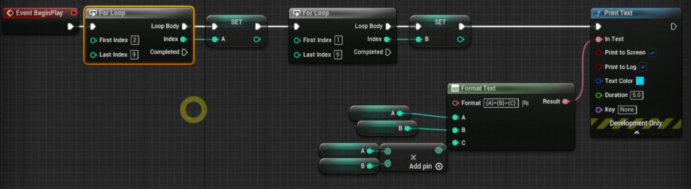

 

## Gate, MultiGate, Do Once, Do N

 

### Gate

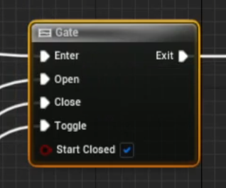

- 통과할 수 있는 문처럼 작동한다
- Open이면 통과하고 Close면 통과하지 않는다

### MultiGate

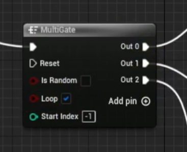

- Sequence 처럼 Out이 순차적으로 동작한다
- Loop를 통해서 반복할 수 있다
- Reset: 처음부터 다시 실행
- Random: Out 중에서 랜덤으로 동작한다

### Do Once
- 한 번만 실행한다

### Do N
- N번 실행한다

 

## Enum

- 콘텐츠 브라우저 안에서 우클릭 -> BluePrints -> Enmeration

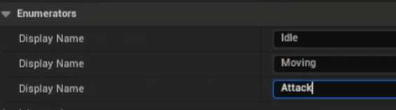

- 생성 후 다음과 같은 Enum Type을 만들 수 있다

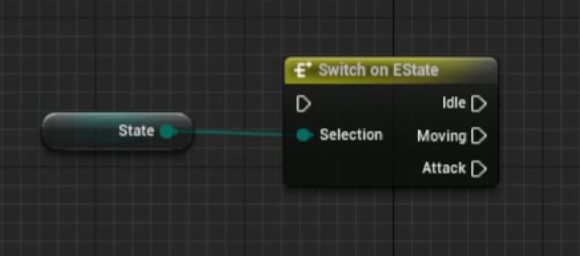

- Switch 문을 통해서 Enum 값에 따라 코드를 분기시킬 수 있다
- Enum To String과 Print String을 통해서 Enum 값을 출력할 수 있다.