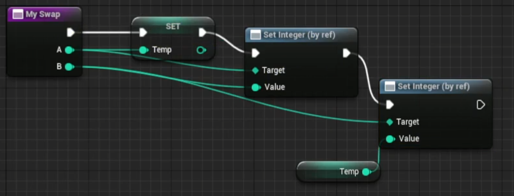

# 함수

 

## 함수 기초

- 우클릭 -> BluePrints -> BluePrint Function Library
- 만들어진 함수는 정적(static) 함수이다
- Details에서 input과 output을 설정할 수 있다

### MyAdd 함수

 

- 위와 같이 함수의 형태로 만들 수 있다

 

## 지역 변수

- 함수 안에서 사용하는 변수를 지역 변수라고 한다
- 지역 변수는 함수 안에서만 사용 가능하고 스택 메모리에 할당된다

 

## 복사와 참조

- 참조는 Set By Ref Var를 사용한다

- 매개변수에 참조 타입을 전달하기 위해선 input의 Pass-By-References를 체크해야한다

 

## 고급 디버깅

- Call Stack 확인하기
- Debug -> BluePrint Debugger
- 함수가 호출된 경로를 알아낼 수 있다