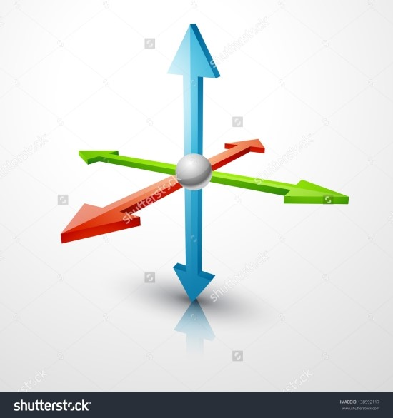
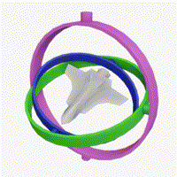
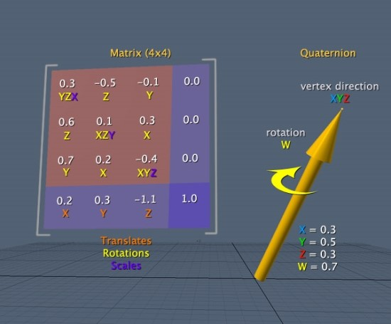

# Gimbal Lock(짐벌 락) 현상

 

### 오일러 각(Euler Angle)

- 어떤 물체의 방향을 3차원 공간 좌표계의 회전으로 이해하는 것
- 3차원 공간에 놓인 물체의 방향은 오일러 각도를 사용하여 세 번의 회전을 통해 얻을 수 있다

 

### 다음과 같은 3차원 좌표계가 있다고 가정하자

- y축을 고정시킨 채로 z축을 반시계 방향으로 90도 회전하게 되면 y축과 x축이 겹치게 된다
- 이렇게 되면 x축과 y축이 같이 움직이는 현상이 일어나게 되고 이를 짐벌락 현상이라고 한다

 

### 짐벌락 현상

 

### Quatemion(사원수)

- 3차원 좌표계에서 회전을 표현할 때, 행렬 대신 사용하는 수학적 개념으로 4개의 값으로 이루어진 복소수 체계이다
- x, y, z 축과 w벡터로 이루어져있다

 

- 짐벌 락 현상이 완벽하게 해결된 것은 아니지만 많이 완화되었다고 한다

 

|   |행렬|사원수|
|---|---|---|
|데이터 량|float 16개|float 4개|
|연산 속도|float 곱셈 16x16회|float 곱셈 16회|
|결과|짐벌 락 등 오류 발생|최단호 보간으로 오류 발생률이 적음|

