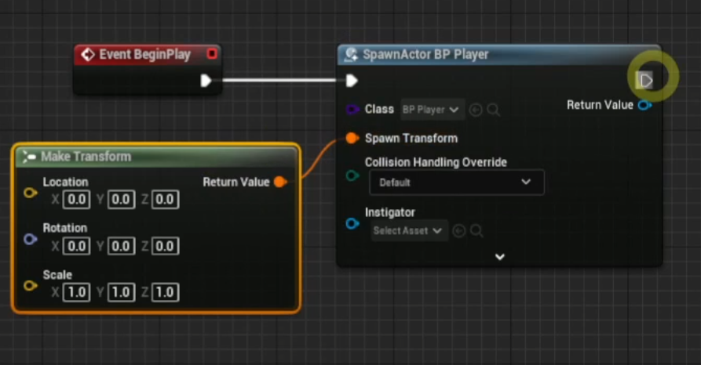
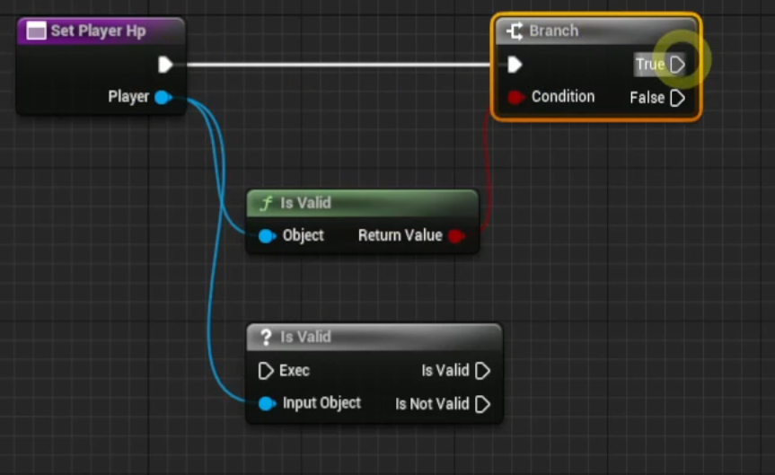

# 객체지향

 

## 멤버 변수와 멤버 함수

 

### 블루프린트 클래스 내의 변수와 함수

- 멤버 함수는 해당 클래스를 대상으로 실행되기 때문에 다른 클래스에서 실행하기 위해선 올바른 클래스를 연결해주어야 한다

 

### 액터를 생성하는 SpawnActor From Class

 

## IsValid

 

- 전달 받은 객체가 유효한지 검사
- Null Check 용도로 사용한다

 

## 상속성

- 상속은 `is-a 관계`를 만족시키는 관계를 가진다
- 클래스들의 공통이 되는 부모 클래스를 생성해 상속한다면 부모클래스의 멤버 변수와 함수를 사용할 수 있다
- 자식 클래스들은 부모 클래스의 형태로 캐스팅하여 사용해 코드의 재사용성을 높일 수 있다

 

## 캐스팅

- Knight 클래스 생성 후 Player 클래스로 Player 변수에 저장
- 이후에 다시 Knight 클래스로 캐스팅하여 사용이 가능하다

 

## 은닉성

- 멤버 변수의 타입 옆의 눈을 통해 에디터에 속성을 보일지 여부에 대해 지정할 수 있다

 

- 멤버 변수의 오른쪽 detail을 통해 private 속성을 지정할 수 있다
- private 속성을 지정하면 외부에서 get, set을 사용할 수 없다
- 멤버 함수는 접근 지정자를 public, protected, private로 지정할 수 있다

 

## 다형성

- 멤버 함수의 Override를 통해 함수 오버라이딩을 할 수 있다

 

## 인터페이스

- 우클릭 -> BluePrints -> BluePrint InterFace
- 실제로 구현은 하지 않는 가상 함수들을 만든다
- 인터페이스를 구현하는 클래스는 반드시 인터페이스의 함수를 재정의해야한다

 

### 인터페이스 구현하기

- 블루프린트 클래스 -> 디테일 -> 인터페이스

 

- 인터페이스를 구현한 클래스는 해당 인터페이스의 타입이 될 수 있다
- 인터페이스는 가상함수를 만들어 상속받아 사용하는 것과 비슷하다

 

## [C++ 에서의 객체지향 예시](https://www.notion.so/UE5-889a2a5393e04d88a974bbbcd5ce7012?pvs=4#865a181fc81548788099b2eeb9b578da)