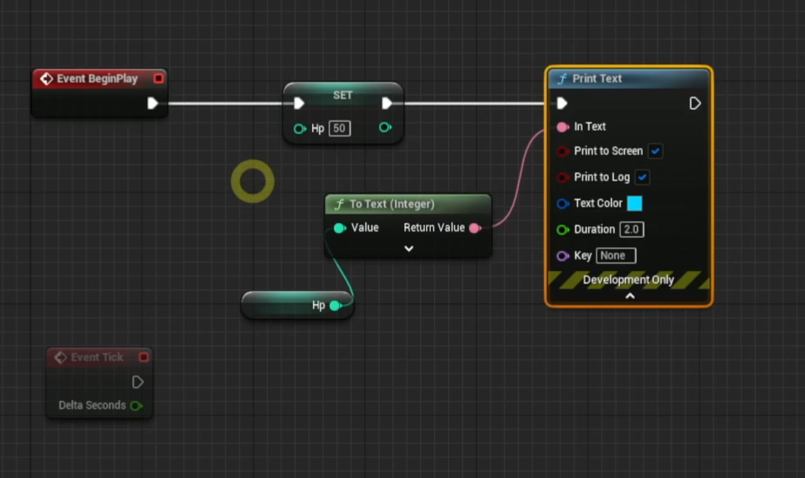
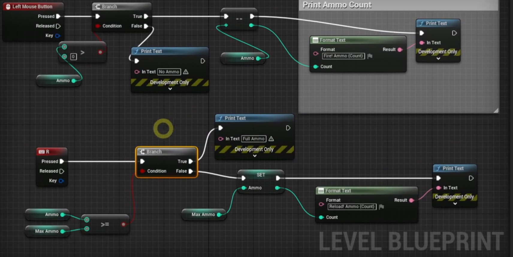
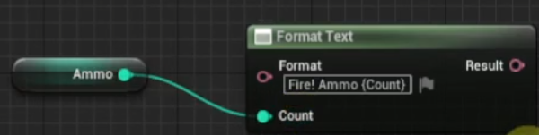
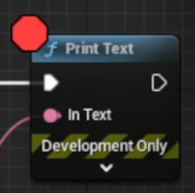

# 변수

<br>

## 변수 타입

<br>

### Boolean
- True, False로 이루어진 이진수 타입
### Byte
- 1Byte의 크기를 가지는 정수 타입
### Integer
- 4Byte의 크기를 가지는 정수 타입
### Integer64
- 8Byte의 부호가 있는 정수 타입으로 다음과 같이 정의되어 있다
```cpp
typedef signed long long int64
```

### Float
- 부동소수점으로 표현되는 소수 타입
### Name
- 변경되지 않는 이름에 주로 사용된다
- 해싱을 통해 데이터의 접근이 빠르다
- 용량을 작게 차지한다
### String
- 일반적인 문자열로 사용된다. e.g.) 플레이어의 이름 등
### Text
- 퀘스트에 대한 텍스트로 주로 사용된다
- 다른 텍스트로 대치할 수 있다

<br>

## Get과 Set

<br>

### Get
- 변수의 값을 받아오는 함수
- ctrl + 드래그 단축키로 사용 가능하다

### Set
- 변수의 값을 설정하는 함수
- alt + 드래그 단축키로 사용 가능하다

<br>



- set에는 설정한 값을 바로 반환하는 기능이 있다

<br>

## 연습 문제: 총알 재장전

<br>



<br>

### Format Text 사용법

<br>



- 변수를 받아와서 출력할 수 있다

<br>

### 디버깅 방법

<br>



- F9: Break Point
- F10: 다음 함수 실행
- F11: 다음 코드 실행