# Vector / Rotator

 

## 구조체

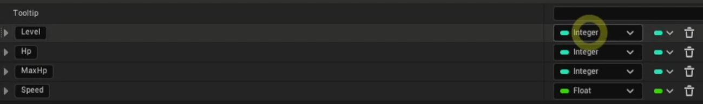

- 우클릭 -> BluePrints -> Structure
- 구조체를 사용하면 데이터를 묶어서 관리할 수 있다

 

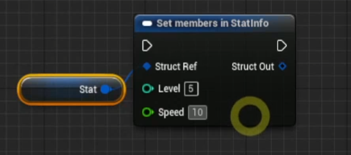

- Set Members In 으로 특정 멤버 변수만을 수정할 수 있다

 

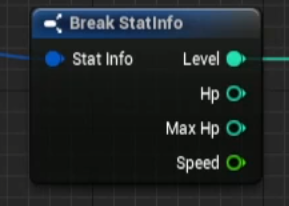

- Break StatInfo를 통해 특정 멤버 변수만을 가져올 수 있다
- 어떤 구조체로 다른 구조체를 Set 한다면 기본적으로 참조가 아닌 `복사`형식을 띈다

 

## 로컬 좌표와 월드 좌표

- 로컬 좌표: 해당 오브젝트가 바라보는 방향을 기준으로 하는 좌표계
    - 즉, 상대적인 좌표계이다
- 월드 좌표: 맵을 기준으로 하는 좌표계
    - 즉, 절대적인 좌표계이다

 

## Vector

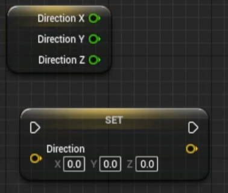

- x, y, z 좌표를 Float 타입 데이터로 가지고 있는 구조체

 

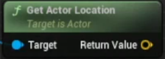

- 액터의 위치를 반환하는 GetActorLocation

 

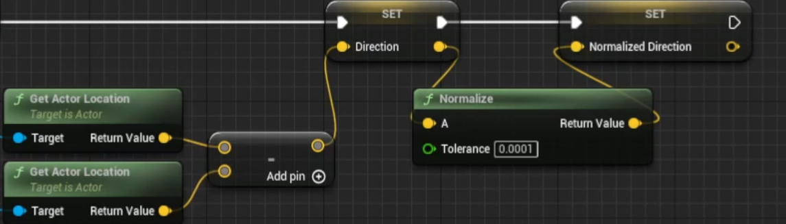

- 단위벡터를 반환하는 Normalize

 

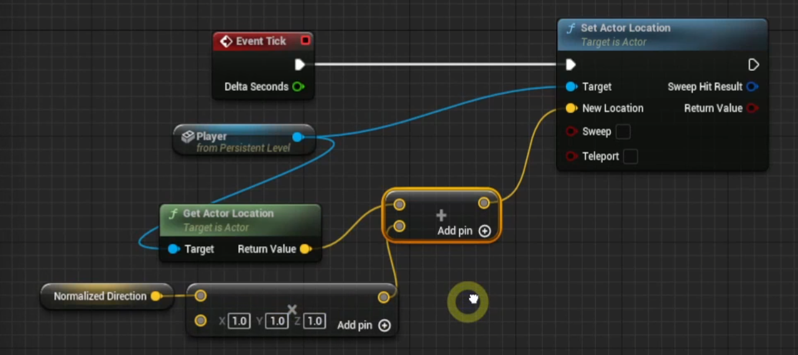

- 특정 오브젝트를 향해 움직이는 방법
- 단위 벡터를 구하고 해당 방향으로 움직인다

 

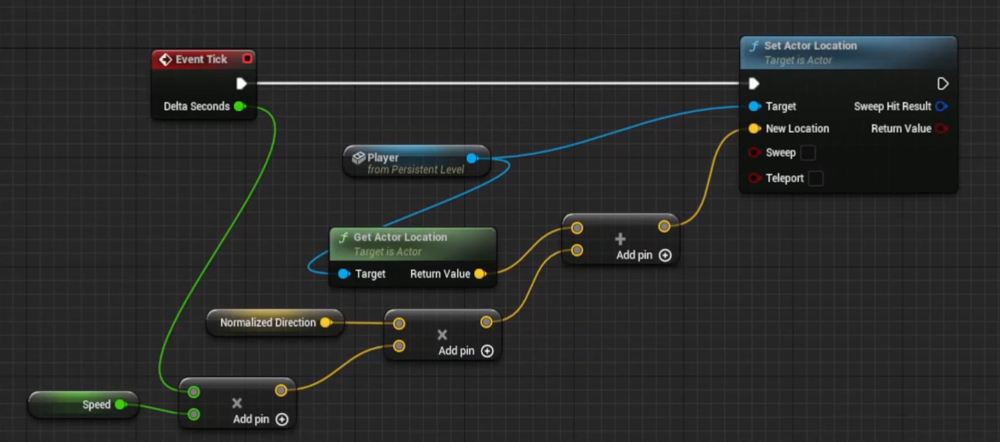

- 주로 이동거리를 시간과 속도를 곱해서 사용한다

 

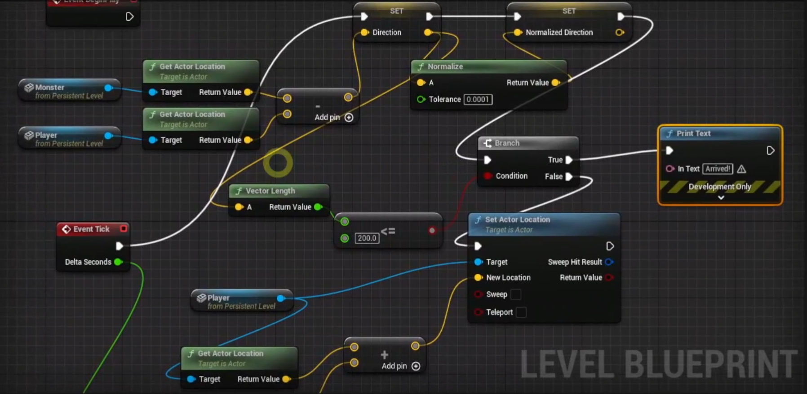

- 벡터의 길이를 구하는 Vector Length
- 두 액터의 위치를 빼서 거리를 구할 수 있다

 

## Rotator

- 회전 정보 Roll(롤), Pitch(피치), Yaw(요)를 Float 타입 데이터로 가지고 있는 구조체

 

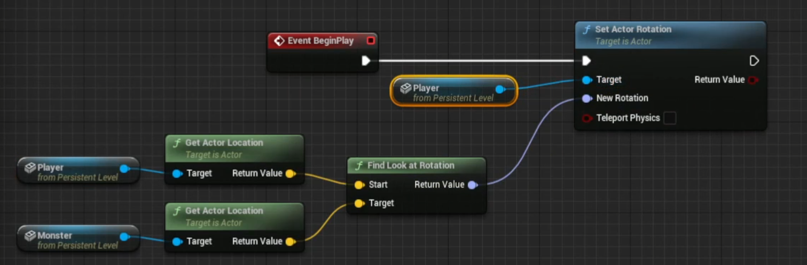

- 대상을 바라보는 회전 값을 반환하는 Find Look At Rotation
- 회전 값을 설정하는 Set Actor Rotation

 

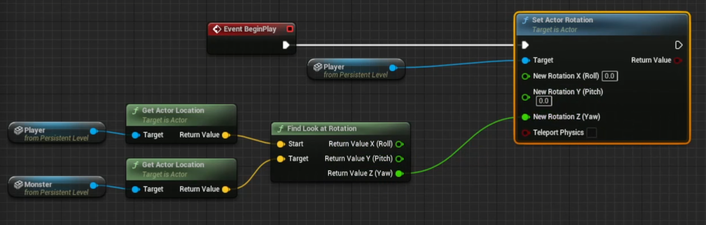

- 특정 회전 값만을 이용해 회전시키기

 

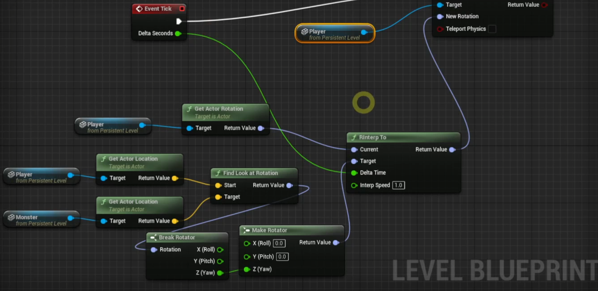

- 회전을 보간하는 RInterp To